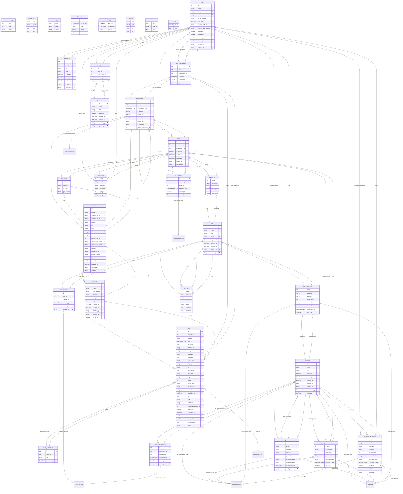

```mermaid
erDiagram

        group_member_type {
            user user
site site
group group
        }
    


        member_type {
            user user
group group
role role
site site
        }
    


        permission_type {
            read read
write write
delete delete
        }
    


        app_type {
            sites sites
refrigeration refrigeration
hvac hvac
energy energy
admin admin
        }
    


        organization_type {
            distributor distributor
organization organization
owner owner
        }
    


        severity {
            high high
med med
low low
all all
        }
    


        action {
            ACK ACK
UNACK UNACK
MUTE MUTE
        }
    


        source {
            device device
app app
        }
    
  "user" {
    Int id "🗝️"
    String email 
    String first_name "❓"
    String last_name "❓"
    String phone_number "❓"
    DateTime start_date "❓"
    String external_auth_id "❓"
    String external_auth_provider "❓"
    Boolean is_active 
    Boolean is_deleted 
    DateTime created_at 
    DateTime updated_at 
    String created_by "❓"
    String updated_by "❓"
    }
  

  "role" {
    Int id "🗝️"
    String name 
    String abrv 
    String desc "❓"
    Boolean is_deleted 
    DateTime created_at 
    DateTime updated_at 
    String created_by "❓"
    String updated_by "❓"
    }
  

  "permission" {
    Int id "🗝️"
    String name 
    String abrv 
    Boolean is_deleted 
    DateTime created_at 
    DateTime updated_at 
    String created_by "❓"
    String updated_by "❓"
    PermissionType permission_type 
    AppType app_type "❓"
    }
  

  "group" {
    Int id "🗝️"
    String name 
    Int organization_id 
    Boolean is_deleted 
    DateTime created_at 
    DateTime updated_at 
    String created_by "❓"
    String updated_by "❓"
    }
  

  "preference" {
    Int id "🗝️"
    Int user_id 
    String key 
    Json value "❓"
    Boolean is_deleted 
    DateTime created_at 
    DateTime updated_at 
    String created_by "❓"
    String updated_by "❓"
    }
  

  "organization" {
    Int id "🗝️"
    String name 
    OrganizationType organization_type 
    Boolean is_deleted 
    DateTime created_at 
    DateTime updated_at 
    String created_by "❓"
    String updated_by "❓"
    Int parent_organization_id "❓"
    }
  

  "site" {
    Int id "🗝️"
    String name 
    String address_line_1 "❓"
    String address_line_2 "❓"
    String country "❓"
    String city "❓"
    String state "❓"
    String zipcode "❓"
    String timezone "❓"
    Int organization_id 
    String contact_first_name "❓"
    String contact_last_name "❓"
    String company "❓"
    String contact_email "❓"
    String contact_number "❓"
    Boolean is_deleted 
    DateTime created_at 
    DateTime updated_at 
    String created_by "❓"
    String updated_by "❓"
    }
  

  "controller" {
    Int id "🗝️"
    String name 
    String mac_address 
    String claimKey "❓"
    Int site_id 
    Boolean is_deleted 
    DateTime created_at 
    DateTime updated_at 
    String created_by "❓"
    String updated_by "❓"
    Boolean is_active 
    }
  

  "app_access" {
    Int id "🗝️"
    String name 
    String abrv 
    Boolean is_deleted 
    DateTime created_at 
    DateTime updated_at 
    String created_by "❓"
    String updated_by "❓"
    }
  

  "alarm" {
    Int id "🗝️"
    Int controller_id 
    String category "❓"
    AlarmActionType ack 
    String ack_user "❓"
    String alarm_class "❓"
    String data_type "❓"
    String app_type "❓"
    String attributes "❓"
    String device_type "❓"
    String display_message "❓"
    String eu "❓"
    String limit_value "❓"
    String message "❓"
    String originator "❓"
    Int priority "❓"
    String repeat_time "❓"
    String report_value "❓"
    String resolution "❓"
    DateTime resolution_at "❓"
    String uid "❓"
    String unit "❓"
    String unit_num "❓"
    Int assigned_user_org_id "❓"
    Boolean is_deleted 
    DateTime generated_at 
    DateTime ack_at "❓"
    DateTime assigned_at "❓"
    String assigned_by "❓"
    String remark "❓"
    }
  

  "alarm_occurrence" {
    Int id "🗝️"
    Int alarm_id 
    String iid "❓"
    DateTime generated_at 
    }
  

  "group_member" {
    Int id "🗝️"
    Int member_id 
    Int group_id 
    GroupMemberType member_type 
    DateTime created_at 
    String created_by "❓"
    }
  

  "user_organization" {
    Int id "🗝️"
    Int user_id 
    Int organization_id 
    DateTime created_at 
    String created_by "❓"
    Boolean is_primary 
    }
  

  "role_member" {
    Int id "🗝️"
    Int role_id 
    Int member_id 
    MemberType member_type 
    DateTime created_at 
    String created_by "❓"
    }
  

  "permission_member" {
    Int id "🗝️"
    Int permission_id 
    Int member_id 
    MemberType member_type 
    DateTime created_at 
    String created_by "❓"
    }
  

  "user_app_access" {
    Int id "🗝️"
    Int user_id 
    Int app_access_id 
    DateTime created_at 
    String created_by "❓"
    }
  

  "user_role" {
    Int roleId 
    String roleName 
    String roleAbrv 
    Int userId 
    String email 
    String firstName 
    String lastName 
    }
  

  "group_role" {
    Int roleId 
    String roleName 
    String roleAbrv 
    Int groupId 
    String groupName 
    }
  

  "user_permission" {
    Int userId 
    String email 
    String firstName 
    String lastName 
    Int permissionId 
    String permissionName 
    String permissionAbrv 
    PermissionType permissionType 
    AppType appType "❓"
    }
  

  "group_permission" {
    Int groupId 
    String groupName 
    Int permissionId 
    String permissionName 
    String permissionAbrv 
    PermissionType permissionType 
    AppType appType "❓"
    }
  

  "role_permission" {
    Int roleId 
    String roleName 
    String roleAbrv 
    Int permissionId 
    String permissionName 
    String permissionAbrv 
    PermissionType permissionType 
    AppType appType "❓"
    }
  

  "user_group" {
    Int userId 
    String email 
    String firstName 
    String lastName 
    Int groupId 
    String groupName 
    }
  

  "site_group" {
    Int siteId 
    String siteName 
    Int groupId 
    String groupName 
    }
  

  "calculated_permission" {
    Int userId 
    String email 
    String firstName 
    String lastName 
    Int permissionId 
    String permissionName 
    String permissionAbrv 
    PermissionType permissionType 
    AppType appType "❓"
    Boolean isEffective 
    String inheritedBy 
    }
  
    "user" o{--}o "preference" : "userPreferences"
    "user" o{--}o "user_organization" : "userOrganizations"
    "user" o{--}o "user_group" : "userGroups"
    "user" o{--}o "user_role" : "userRoles"
    "user" o{--}o "user_permission" : "userPermissions"
    "user" o{--}o "calculated_permission" : "calculatedPermissions"
    "user" o{--}o "user_app_access" : "userAppAccesses"
    "role" o{--}o "role_member" : "roleMembers"
    "role" o{--}o "user_role" : "userRoles"
    "role" o{--}o "role_permission" : "rolePermissions"
    "role" o{--}o "group_role" : "groupRoles"
    "permission" o|--|| "PermissionType" : "enum:permission_type"
    "permission" o|--|o "AppType" : "enum:app_type"
    "permission" o{--}o "permission_member" : "permissionMembers"
    "permission" o{--}o "user_permission" : "userPermissions"
    "permission" o{--}o "group_permission" : "groupPermissions"
    "permission" o{--}o "role_permission" : "rolePermissions"
    "permission" o{--}o "calculated_permission" : "calculatedPermissions"
    "group" o|--|| "organization" : "organization"
    "group" o{--}o "group_member" : "groupMembers"
    "group" o{--}o "user_group" : "userGroups"
    "group" o{--}o "group_role" : "groupRoles"
    "group" o{--}o "group_permission" : "groupPermissions"
    "group" o{--}o "site_group" : "siteGroups"
    "preference" o|--|| "user" : "user"
    "organization" o|--|| "OrganizationType" : "enum:organization_type"
    "organization" o{--}o "user_organization" : "userOrganizations"
    "organization" o{--}o "organization" : "subOrganizations"
    "organization" o|--|o "organization" : "parentOrganization"
    "organization" o{--}o "group" : "groups"
    "organization" o{--}o "site" : "sites"
    "site" o|--|| "organization" : "organization"
    "site" o{--}o "site_group" : "siteGroups"
    "site" o{--}o "controller" : "controller"
    "controller" o|--|| "site" : "site"
    "controller" o{--}o "alarm" : "alarms"
    "app_access" o{--}o "user_app_access" : "UserAppAccesses"
    "alarm" o|--|| "AlarmActionType" : "enum:ack"
    "alarm" o|--|| "controller" : "controller"
    "alarm" o|--|o "user_organization" : "userOrganization"
    "alarm" o{--}o "alarm_occurrence" : "alarmOccurrences"
    "alarm_occurrence" o|--|| "alarm" : "alarm"
    "group_member" o|--|| "GroupMemberType" : "enum:member_type"
    "group_member" o|--|| "group" : "group"
    "user_organization" o|--|| "user" : "user"
    "user_organization" o|--|| "organization" : "organization"
    "user_organization" o{--}o "alarm" : "alarms"
    "role_member" o|--|| "MemberType" : "enum:member_type"
    "role_member" o|--|| "role" : "role"
    "permission_member" o|--|| "MemberType" : "enum:member_type"
    "permission_member" o|--|| "permission" : "permission"
    "user_app_access" o|--|| "user" : "user"
    "user_app_access" o|--|| "app_access" : "appAccess"
    "user_role" o|--|| "user" : "user"
    "user_role" o|--|| "role" : "role"
    "group_role" o|--|| "role" : "role"
    "group_role" o|--|| "group" : "group"
    "user_permission" o|--|| "PermissionType" : "enum:permissionType"
    "user_permission" o|--|o "AppType" : "enum:appType"
    "user_permission" o|--|| "user" : "user"
    "user_permission" o|--|| "permission" : "permission"
    "group_permission" o|--|| "PermissionType" : "enum:permissionType"
    "group_permission" o|--|o "AppType" : "enum:appType"
    "group_permission" o|--|| "group" : "group"
    "group_permission" o|--|| "permission" : "permission"
    "role_permission" o|--|| "PermissionType" : "enum:permissionType"
    "role_permission" o|--|o "AppType" : "enum:appType"
    "role_permission" o|--|| "role" : "role"
    "role_permission" o|--|| "permission" : "permission"
    "user_group" o|--|| "user" : "user"
    "user_group" o|--|| "group" : "group"
    "site_group" o|--|| "site" : "site"
    "site_group" o|--|| "group" : "group"
    "calculated_permission" o|--|| "PermissionType" : "enum:permissionType"
    "calculated_permission" o|--|o "AppType" : "enum:appType"
    "calculated_permission" o|--|| "user" : "user"
    "calculated_permission" o|--|| "permission" : "permission"
```
